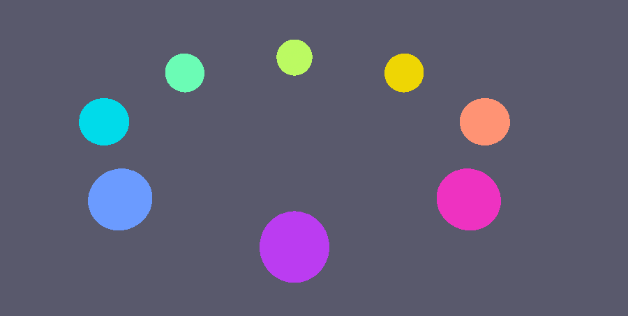
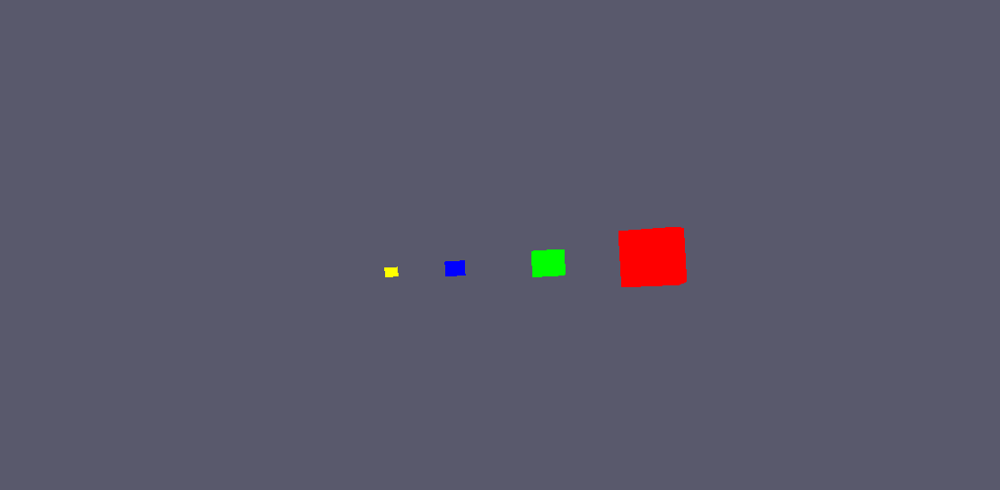
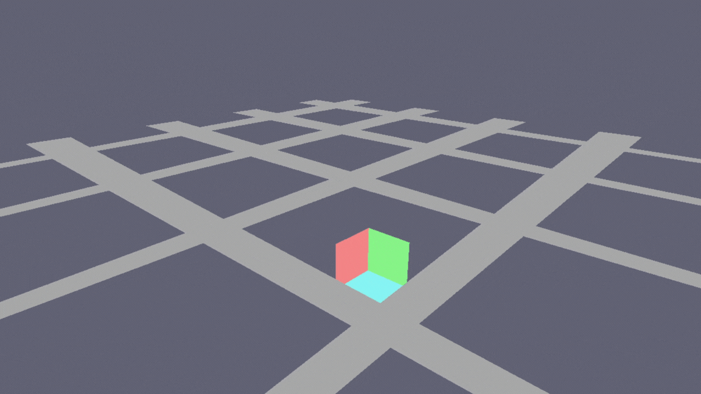

# MML Graphic Examples

A collection of graphics examples demonstrating the Machina Math Library (MML). These examples showcase various mathematical concepts and rendering techniques using Vulkan.

---

## Examples

### 01_spheres.cpp - Sphere Generation

Demonstrates procedural sphere mesh generation using MML's `Spheref` class with color gradients.

**Features:**
- Procedural sphere vertex generation using spherical coordinates
- Spheref class for sphere data (center and radius)
- 8 spheres arranged in a circle
- Color gradients based on angular position

---

### 02_quaternion_slerp.cpp - Quaternion Rotation

Demonstrates quaternion rotations and SLERP (Spherical Linear Interpolation).

**Features:**
- Quaternionf for rotation representation
- SLERP interpolation between rotations
- Bezier curves for smooth animation paths

---

### 03_transforms.cpp - Hierarchical Transforms

Demonstrates hierarchical transform nodes with parent/child relationships.

**Features:**
- TransformNodef for scene graph hierarchy
- Parent/child transform propagation
- Combined transformations

---

### 04_free_camera.cpp - Free Fly Camera

First-person free fly camera for navigating 3D space.

**Controls:**
| Key | Action |
|-----|--------|
| W | Move forward |
| S | Move backward |
| A | Strafe left |
| D | Strafe right |
| Space | Move up |
| Left Shift | Move down |
| Left Click | Toggle mouse capture |
| Mouse | Look around |

**Features:**
- WASD movement relative to camera direction
- Mouse look with pitch/yaw rotation
- Grid floor for spatial orientation
- Multi-colored cube at origin

---